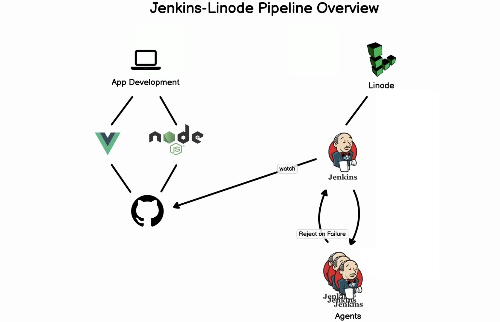

# Jenkins Setup Guide


This guide provides step-by-step instructions for setting up Jenkins on a Linode server. For a visual walkthrough, refer to the accompanying [video tutorial](https://www.youtube.com/watch?v=f4idgaq2VqA).

## Prerequisites
1. Sign in to [Linode](https://www.linode.com) and navigate to the Marketplace.
2. Spin up a Jenkins server from the Marketplace to be used later.

## Installation Steps

### 1. Access Jenkins Dashboard
- Visit the IP address of your Jenkins server on port 8080 in your web browser.

### 2. Initial Server Configuration
- SSH into your server to retrieve the Jenkins initial password.
- Install essential tools: Git, Python, python3-venv, and Pip using `apt-get install`.

### 3. Plugin Installation
- On the Jenkins dashboard, click "Install suggested plugins" to set up the basic environment.

### 4. Blue Ocean Integration
- Navigate to "Manage Jenkins," then "Manage Plugins," and install the Blue Ocean plugin.

### 5. Docker Setup
- Install Docker and Docker Compose build step to enable Docker integration.

### 6. Open Blue Ocean
- Return to the Jenkins dashboard and click "Open Blue Ocean" to access the new user-friendly interface.

### 7. Pipeline Creation
- Create a pipeline and link it to your GitHub repository.

### 8. Repository Integration
- Select the repository you want to add to Jenkins. Ensure that Git is added to create Jenkins tasks.

### 9. Parallel Tasks
- For parallel tasks, add commands in the pipeline script. Example:
  ```groovy
  stages {
      stage('Parallel Stage') {
          parallel {
              stage('File List') {
                  steps {
                      sh 'ls -la'
                  }
              }
              stage('Environment Setup') {
                  steps {
                      sh 'python3 -m venv test'
                      sh 'source test/bin/activate'
                      sh 'pip3 install -r requirements.txt'
                      sh 'python3 utest.py'
                  }
              }
          }
      }
  }
  ```


By following these steps, you will have a fully configured Jenkins server with integrated plugins, Docker support, and a pipeline linked to your GitHub repository.

#### 10. Deploy Jenkins on Docker

Before starting, ensure Docker is installed on your machine.

```bash
docker run -p 8080:8080 -p 50000:50000 jenkins/jenkins:lts
```

Access Jenkins at [http://localhost:8080](http://localhost:8080) and follow the setup instructions.

#### 11. Add Docker Build to Jenkins Pipeline

Edit your Jenkins pipeline to include a Docker build step:

```groovy
pipeline {
    agent any

    stages {
        stage('Build and Push Docker Image') {
            steps {
                script {
                    // Add your build steps here
                    sh 'docker build -f Dockerfile <path_to_directory>'
                }
            }
        }

        stage('Login to Docker Registry') {
            steps {
                script {
                    sh 'docker login -u <username> -p <password> ghcr.io'
                }
            }
        }

        stage('Push Docker Image to Registry') {
            steps {
                script {
                    sh 'docker push ghcr.io/<username>/<projectname:tag>'
                }
            }
        }
    }
}
```

#### 12. Automate Jenkins Pipeline on GitHub Changes

For automated builds, configure Jenkins to trigger on GitHub commits. Two methods are available:

##### a. Push Notification:

- Install GitHub Pull Request Builder in Jenkins.
- Configure GitHub credentials in Jenkins.
- Configure GitHub Webhooks to point to your Jenkins instance.
- In Jenkins, navigate to the GitHub Pull Request Builder section and provide the necessary GitHub credentials.

##### b. Jenkins Checks:

- Ensure Jenkins is configured to check for changes periodically.
- Configure GitHub Webhooks to point to your Jenkins instance.
- Use GitHub Webhooks to trigger Jenkins builds on push events.

Note: The push notification method is recommended for efficiency.

#### Additional Notes:

- Make sure to replace `<username>`, `<password>`, `<projectname>`, and `<tag>` with your actual Docker registry and project details.
- Adjust the Dockerfile path and build steps as needed for your project.

Now, your Jenkins pipeline is set up to build and deploy Docker images automatically when changes occur in your GitHub repository.
